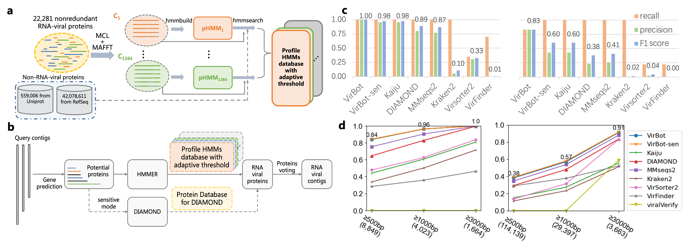

# VirBot: an RNA viral contig detector for metagenomic data
Without relying on cultivation, metagenomic sequencing greatly accelerated the novel RNA virus detection. However, it is not trivial to accurately identify RNA viral contigs from a mixture of species. The low content of RNA viruses in metagenomic data requires a highly specific detector, while new RNA viruses can exhibit high genetic diversity, posing a challenge for alignment-based tools.
    
Here, we develop VirBot, an easy-to-use yet effective RNA virus detection tool from metagenomic data. It takes assembled contigs as input and detect ones from RNA viruses. For each detected contig, we assign it the likely taxon label according to the encoded protein that has the highest score against our pHMMs.
    
VirBot is deisgned based on a comprehensive RNA viral protein family database. Besides the hallmar gene in RNA virus, RdRps, we also leverage other essential proteins, including capsid proteins, envelop proteins, viral auxiliary proteins, etc. By using the adaptative bit score cutoff, VirBot shows its higher specificity in metagenomic dataset and sensitivity in novel RNA virus dataset. VirBot supports identifying contigs as short as 500bp. The construction of RNA viral pHMMs and key components of VirBot are shown as Fig (a,b). For each RNA viral pHMM, we use voting strategy among the clustered viral proteins to determine the taxon, which is used for the taxonomic assignment of the detected contigs. 

We validated VirBot in various scenarios and benchmarked it with other 7 RNA virus detection tools. VirBot achieves higher recall than other tools. And it also demonstrates high specificity in metagenomic data that only contains a small number of RNA viruses. Here, we briefly show the result of VirBot on metagenomics data (Fig (c)) and pure RNA virus dataset (Fig (d)).

|  |
|:--:|
| (a) Construction of the RNA viral pHMMs database. (b) Sketch of the key components of VirBot. (c) Detection performance on simulated data: ERR1992810 (left) and ERR2185279 (right). (d) Recall on RNA viral datasets: RNA phages dataset (left) and marine water RNA virome dataset (right). 
where the metagenomics dataset contains sequences from 82 eukaryotes, 365 prokaryotes, and DNA/RNA viruses; and for the RNA virus datasets, one comprises 8,849 RNA phages that were barely detected before, while eukaryotic viruses dominate known RNA viruses; another dataset is an RNA virome sample sequenced from marine water containing 114,139 RNA viral seqeunces.| 

## Dependency:
* Prodigal
* HMMER3
* DIAMOND
* pandas
* python 3.x

### Quick install

1. We highly recommend using `conda` to install all the dependencies.
```bash
# create the environment and install the dependencies
conda create -n virbot -c bioconda prodigal hmmer diamond python=3 pandas
# activate the environment
conda activate virbot
```

2. Please download VirBot by "git clone"
```
git clone https://github.com/GreyGuoweiChen/RNA_virus_detector
cd RNA_virus_detector
```

3. Please download the database file from [OneDrive](https://portland-my.sharepoint.com/:f:/g/personal/gwchen3-c_my_cityu_edu_hk/EufG0D1CYLREg_7K1UgMvpwBg6bbBIJSM0vdV5udvw1k_w?e=nOJo3G) and uncompress them in the same directory with VirBot.py .
```
unzip ref.zip
```
    
The ref folder should be place under RNA_virus_detector and contain 4 database files: VirBot.hmm, VirBot.dmnd, VirBot_hmm_threshold.txt, and VirBot_RNAvirus_acc.txt, representing the pHHMs database, DIAMOND database, adaptive threshold file, and all the collected RNA virus accession number, respectively.

4. You may want to add permissions to all database file.
```
chmod -R 777 ref
```

5. (Optional) If you want to use VirBot as an executable file, please add VirBot to your environment variables path.
For examples (if your .bashrc file is under the user directory):
    
    For macOS:
    ```
    echo 'PATH=$PATH:YOUR_DIC/RNA_virus_detector' >> ~/.bashrc
    ```
    
    For Linux:
    ```
    echo 'PATH="$PATH:YOUR_DIC/RNA_virus_detector"' >> ~/.bashrc
    ```
    Please replace YOUR_DIC by the path of RNA_virus_detector.
    
    Please remember to activate the PATH by:
    ```
    source ~/.bashrc
    ```
    and check its avaiability by:
    ```
    echo $PATH
    ```
    
## Usage:
The VirBot is friendly to use. It requires input as fasta format and will return the fasta format output file with the identified RNA virus sequences. 

```
# If the environment variables path is correctly set and you run VirBot.py as an executable file.
VirBot.py [--input INPUT_CONTIG] [--output OUTPUT_DIRECTORY] [--sen]

# If you run VirBot.py as python script.
python VirBot.py [--input INPUT_CONTIG] [--output OUTPUT_DIRECTORY] [--sen]
```

### Options 

```
--input: The input contig file in fasta format.
--output: The output directory (default: VB_result).
--sen (Optional): Use the sensitive mode for VirBot.
```

### Example:
  
```
VirBot.py --input test/test_input.fa

VirBot.py --input test/test_input.fa --output VB_result --sen
```
